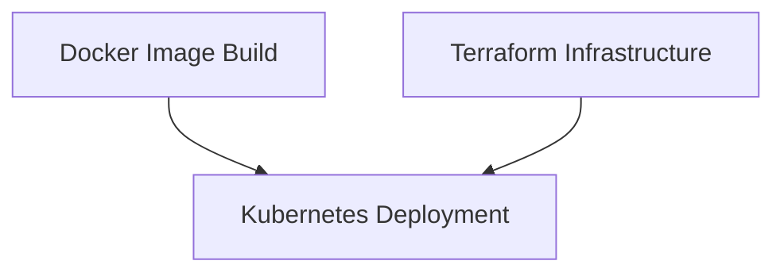

# GitHub Actions Workflows

This directory contains the CI/CD workflows for the QR Code Generator project. The workflows handle Docker image builds, infrastructure provisioning via Terraform, and application deployment to AKS.


## Workflows

### 1. Docker Image Build (`build-docker.yaml`)
- **Purpose:** Builds and (optionally) publishes Docker images for both frontend and backend services.
- **Triggers:**
  - Changes to Dockerfile
  - Manual trigger with `workflow_dispatch`
- **Required Secret:**
  - `DOCKER_HUB_ACCESS_TOKEN`
- **Workflow Output:**  
  Builds images and pushes them to Docker Hub when configured.

### 2. Terraform Infrastructure (`terraform-infrastructure.yaml`)
- **Purpose:** Provisions and manages Azure resources (AKS, Storage Account, Vnet, etc.) using Terraform
- Supports multiple environments (development, staging, production)
- **Triggers:**
  - Changes to `.tf` files
  - Manual trigger with environment selection
- Required secrets:
  - `AZURE_CREDENTIALS`
- Outputs:
  - `aks_cluster_name`
  - `container_name`
  - `resource_group_name`
  - `storage_account_name`
- **Notes:**
  - These outputs are saved as JSON and uploaded as artifact to be later consumed by the Kubernetes deployment workflow.

### 3. Kubernetes Deployment (`k8s-manifests-deployment.yaml`)
- **Purpose:** Deploys application components (backend and frontend) to the AKS cluster using the manifests stored in the `k8s/` folder.
- Manages secrets, deployments, and services
- **Triggers:**
  - Changes to k8s manifests files.
  - Manual trigger via Github Actions.
- Required secrets:
  - `AZURE_CREDENTIALS`
- **Process:**
  - The workflow downloads the Terraform outputs (e.g., container name and storage account name) via artifact and uses them to inject values into the manifests.
  - It creates or updates the Kubernetes secret for the storage connection string.
  - Finally, it applies the Kubernetes manifests to update deployments and services in AKS.

## Prerequisites

1. **Azure Credentials**
```powershell
# Login to Azure first
az login

# Get subscription ID
$subscription_id = az account show --query id -o tsv

# Create service principal
az ad sp create-for-rbac `
    --name "qr-code-generator-sp" `
    --role contributor `
    --scopes /subscriptions/$subscription_id `
    --sdk-auth
```
- Add the output JSON as a repository secret named `AZURE_CREDENTIALS`

2. **Docker Hub Access**
   - Create Docker Hub access token at [personal-access-token](https://hub.docker.com/settings/security)

   - Add it as secret `DOCKER_HUB_ACCESS_TOKEN`
  
3. **Azure Storage**
   - Configure your Azure Storage Account and container.
   - Ensure that the storage account name is provided as `AZURE_STORAGE_ACCOUNT` and the container name as `AZURE_CONTAINER_NAME`.
  
## Workflow Dependencies


The above diagram illustrates that both the Docker build and Terraform workflows feed into the Kubernetes deployment pipeline.

## Environment Variables
All required environment variables are managed through:
- GitHub Secrets
- Terraform outputs
- Kubernetes Secrets

## Manual Triggers

Each workflow can be triggered manually from the Actions tab with specific inputs:

1. **Docker Build**
   - Triggered manually to build updated Docker images
   - Optional: Push images to Docker Hub

2. **Terraform**
   - Select environment
   - Optional: Apply changes

3. **Kubernetes**
   - Triggered manually to deploy the latest manifests after infrastructure or image updates.

## Monitoring Deployments

- Check workflow runs in GitHub Actions tab
- View detailed logs for each step
- Status badges available for README

## Troubleshooting

Common issues and solutions:

1. **Docker Build Failures**
   - Verify Docker Hub credentials
   - Verify Docker image tags
   - Check Dockerfile paths

2. **Terraform Errors**
   - Verify Azure credentials `AZURE_CREDENTIALS`
   - Check for valid Terraform state

3. **Kubernetes Deployment Issues**
   - Verify AKS credentials & cluster access
   - Verify that the Kubernetes manifests reference the correct resource names.
   - Check manifest syntax
   - Ensure that secrets and configuration values (like `AZURE_STORAGE_CONNECTION_STRING` and `AZURE_CONTAINER_NAME`) are injected as expected.
   - Check pod logs in cluster:`kubectl logs -l app=qr-api`
   - Verify secrets: `kubectl get secrets`