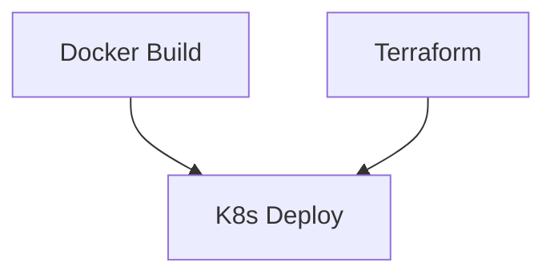

# GitHub Actions Workflows

This directory contains the CI/CD workflows for the QR Code Generator project.

## Workflows

### 1. Docker Image Build (`build-docker.yaml`)
- Builds and publishes Docker images for both frontend and backend
- Triggered by:
  - Changes to Dockerfile
  - Manual trigger with optional image push
- Required secrets:
  - `DOCKER_HUB_ACCESS_TOKEN`

### 2. Terraform Infrastructure (`terraform-infrastructure.yaml`)
- Manages Azure infrastructure using Terraform
- Supports multiple environments (development, staging, production)
- Triggered by:
  - Changes to `.tf` files
  - Manual trigger with environment selection
- Required secrets:
  - `AZURE_CREDENTIALS`
  - `AZURE_RESOURCE_GROUP`
  - `AKS_CLUSTER_NAME`

### 3. Kubernetes Deployment (`k8s-manifests-deployment.yaml`)
- Deploys application to AKS cluster
- Manages secrets, deployments, and services
- Triggered by:
  - Changes to k8s manifests
  - Manual trigger
- Required secrets:
  - `AZURE_CREDENTIALS`
  - `AZURE_RESOURCE_GROUP`
  - `AKS_CLUSTER_NAME`
  - `AZURE_STORAGE_ACCOUNT`
  - `AZURE_STORAGE_KEY`

## Prerequisites

1. **Azure Credentials**
   ```powershell
   az ad sp create-for-rbac --name "github-actions" --role contributor --scopes /subscriptions/<subscription-id> --sdk-auth
   ```
   Add the output JSON as a secret named `AZURE_CREDENTIALS`

2. **Docker Hub Access**
   - Create a Docker Hub access token
   - Add as secret `DOCKER_HUB_ACCESS_TOKEN`

3. **Azure Storage**
   - Add storage account name as `AZURE_STORAGE_ACCOUNT`
   - Add storage key as `AZURE_STORAGE_KEY`

## Workflow Dependencies



## Manual Triggers

Each workflow can be triggered manually from the Actions tab with specific inputs:

1. **Docker Build**
   - Optional: Push images to Docker Hub

2. **Terraform**
   - Select environment
   - Optional: Apply changes

3. **Kubernetes**
   - Deploys latest manifests

## Monitoring Deployments

- Check workflow runs in GitHub Actions tab
- View detailed logs for each step
- Status badges available for README

## Troubleshooting

Common issues and solutions:

1. **Docker Build Failures**
   - Verify Docker Hub credentials
   - Check Dockerfile paths

2. **Terraform Errors**
   - Verify Azure credentials
   - Check for valid Terraform state

3. **Kubernetes Deployment Issues**
   - Verify AKS credentials
   - Check manifest syntax
   - Review pod logs in cluster